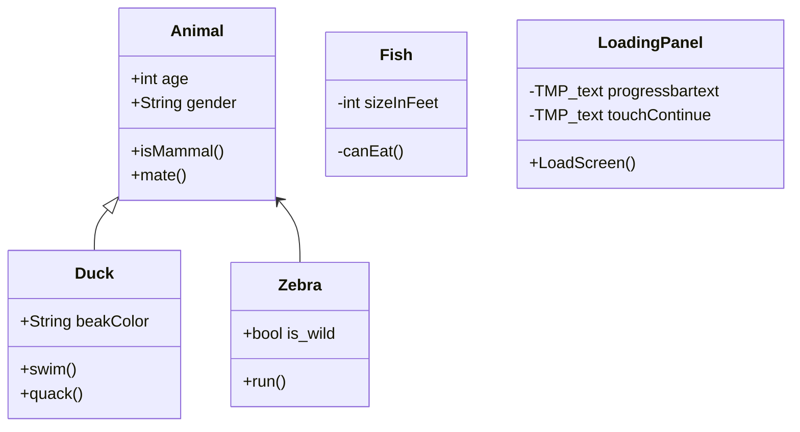

```mermaid
classDiagram
    Animal <|-- Duck
    Animal <-- Zebra
    Animal : +int age
    Animal : +String gender
    Animal: +isMammal()
    Animal: +mate()
    class Duck{
      +String beakColor
      +swim()
      +quack()
    }
    class Fish{
      -int sizeInFeet
      -canEat()
    }
    class Zebra{
      +bool is_wild
      +run()
    }
    class LoadingPanel{
      -TMP_text progressbartext
      -TMP_text touchContinue
      +LoadScreen()
      }
```
